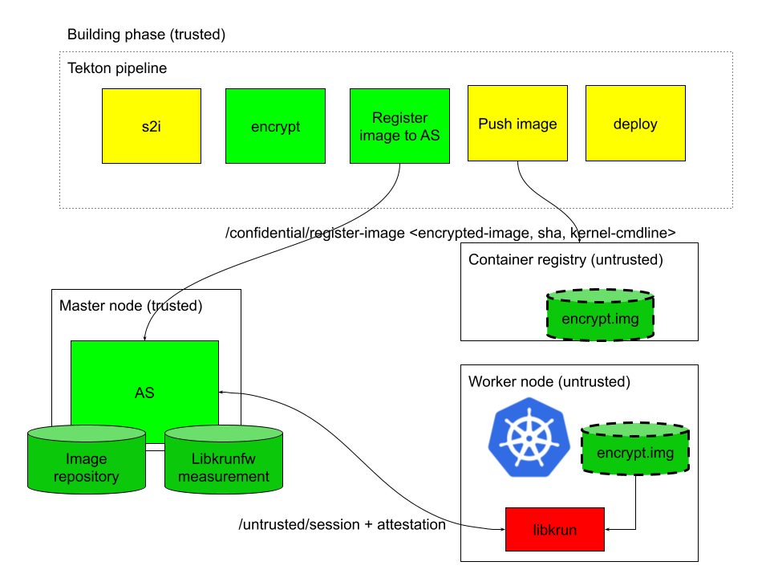

# Attestation server and setup to deploy confidential workloads on k8s

This repository contains the setup and scripts to deploy the various components for:
  * Attestation server for the encrypted image registration and confidential computing attestation using libkrun
  * Building the encrypted images to be used with libkrun
  * The tekton tasks for building the encrypted images and register the encrypted image

The picture illustrates the architecture and how the components interact between each other

